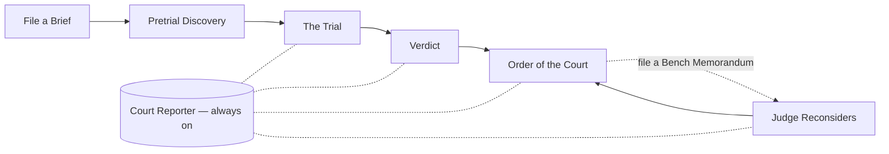

# ⚖️ POPPER-PROOF COURT

> *"Where every scientific hypothesis goes on trial — and only the bulletproof get funded."*

*Named after [Karl Popper](https://en.wikipedia.org/wiki/Karl_Popper), the father of falsifiability — this courtroom puts your hypothesis through a gauntlet of skepticism, because in science, only what survives cross-examination is bulletproof.*

**Hack-Nation 5th Global AI Hackathon — Challenge 04: The AI Scientist (Powered by Fulcrum Science)**

POPPER-PROOF COURT is a multi-agent **Science Research Court** that takes a scientific hypothesis, puts it on trial through a structured Prosecutor-vs-Defender-vs-Judge protocol grounded in real precedent, and delivers a runnable experiment plan with budget, timeline, materials, and citations the user can audit end-to-end. After the verdict, the parties can move for reconsideration — file a Bench Memorandum, the Judge re-deliberates, the plan redraws under the new constraints.

---

## 📼 Submission

| | Link |
|---|---|
| **Demo video (≤60s)** | _TODO: paste YouTube/Loom URL after recording_ |
| **Tech video (≤60s)** | _TODO: paste YouTube/Loom URL after recording_ |
| **GitHub** | https://github.com/panforrest/POPPER-PROOF-COURT |
| **Live deployment** | _local-only for the demo_ |

Recording scripts and shot list: see [`DEMO_SCRIPT.md`](./DEMO_SCRIPT.md).

---

## 🎯 The Problem

Researchers spend weeks — and labs spend $20K–$50K — chasing hypotheses that were already disproven, already in press, or fundamentally underspecified. The CRO model checks paperwork. It does not stress-test the science.

## 💡 The Solution

A **courtroom for science**. Three AI agents adversarially debate your hypothesis over a record of real published precedent. The Judge rules with a confidence score. The Clerk turns the ruling into a runnable plan. You can interrogate the Court Reporter for follow-ups, or file a Bench Memorandum — *"tighten the timeline,"* *"cap the budget at $3K,"* *"counsel stipulates citation [1] has been retracted"* — and the bench reconsiders, live.

---

## 🏛️ The Four Pillars (and the Sidekick)

| # | Pillar | What it does | Powered by |
|---|---|---|---|
| 1 | **Pretrial Discovery** | Pulls real precedent for the hypothesis; classifies novelty (`not_found` / `similar` / `exact_match`) | Tavily + Semantic Scholar |
| 2 | **The Trial** | Prosecutor (red), Defender (blue), Judge (gold) debate over 5 turns; every claim carries a `[N]` citation marker | Claude Sonnet 4.5 + GPT-4o, streamed over SSE |
| 3 | **Order of the Court** | Auto-drafted experiment plan — risks, methods, materials, budget, timeline, validation checkpoints | GPT-4o |
| 4 | **Bench Memorandum** | Post-verdict reconsideration: file a motion, Judge re-deliberates over the same record + new instruction, plan auto-regenerates | GPT-4o |
| ★ | **Court Reporter** *(always-on sidekick)* | Slide-over chat that can answer questions about the case, citations, verdict, plan, and any filed memoranda — with markdown + `[N]` provenance | GPT-4o |



---

## 🎨 Brand & Layout

- **Headline font**: Playfair Display (legal gravitas)
- **Body font**: Inter
- **Background**: `#0A0A0F` (cinematic dark)
- **Prosecutor accent**: `#DC2626` red · **Defender accent**: `#2563EB` blue · **Judge accent**: `#D97706` gold

```
┌──────────────────────────────────────────────────────────┐
│ DOCKET HEADER · PRETRIAL DISCOVERY (citations)           │
├──────────────┬──────────────────────────┬────────────────┤
│ PROSECUTOR   │        JUDGE             │   DEFENDER     │
│ (red)        │   (gold, raised bench)   │   (blue)       │
│ Argument →   │   Belief gauge           │   ← Argument   │
│              │   Verdict + confidence   │                │
├──────────────┴──────────────────────────┴────────────────┤
│ BENCH MEMORANDUM · "Issue an Order from the Bench"       │
│ ─ pre-fill chips · Cmd+Enter to file · live re-rule      │
├──────────────────────────────────────────────────────────┤
│ ORDER OF THE COURT — runnable experiment plan            │
└──────────────────────────────────────────────────────────┘
                                  [Approach the Bench →]
```

---

## ⚙️ Tech Stack (as shipped)

### Frontend
- **Next.js 16** (App Router, Turbopack) · **React 19** · **TypeScript**
- **Tailwind CSS v4** · **shadcn/ui** primitives
- **Framer Motion** — courtroom animations
- **react-markdown** + **remark-gfm** — Reporter chat rendering
- Custom SSE consumer over `fetch` + `ReadableStream` for POST-streaming endpoints (Reporter, Bench Memorandum)

### Backend
- **Python 3.11** · **FastAPI** · **sse-starlette**
- **Pydantic** — typed schemas across the wire
- **httpx** — async LLM + search calls
- In-memory store (cases, discovery, trial results, plans, memoranda) — fits the demo, swappable for SQLite/Postgres later

### LLM / Search Providers
| Role | Model / Provider |
|---|---|
| Prosecutor | Anthropic `claude-sonnet-4-5-20250929` |
| Defender | OpenAI `gpt-4o` |
| Judge | OpenAI `gpt-4o` (also: Reporter, Planner) |
| Pretrial — open web | **Tavily Search API** |
| Pretrial — peer review | **Semantic Scholar Graph API** |

> Mock-mode fallback: if no API keys are present, the backend still streams a plausible canned trial so the UI is demoable offline.

---

## 🚀 Run Locally

```bash
# 1. Clone & enter
git clone https://github.com/panforrest/POPPER-PROOF-COURT.git
cd POPPER-PROOF-COURT

# 2. Configure secrets (NEVER commit .env)
cp .env.example .env
# then edit .env and add: OPENAI_API_KEY, ANTHROPIC_API_KEY, TAVILY_API_KEY

# 3. Backend
cd backend
python3 -m venv .venv && source .venv/bin/activate
pip install -r requirements.txt
uvicorn app.main:app --reload --port 8000      # → http://localhost:8000

# 4. Frontend (separate terminal)
cd frontend
npm install
npm run dev                                     # → http://localhost:3000
```

Health checks: `GET /health`, `GET /trial/engine`, `GET /reporter/engine`, `GET /bench/engine`.

---

## 📂 Repo Map (key files)

```
POPPER-PROOF COURT/
├── README.md                              ← you are here
├── DEMO_SCRIPT.md                         ← 60s × 2 shooting scripts
├── .env.example
├── backend/
│   └── app/
│       ├── main.py                        # FastAPI app + CORS + router mounts
│       ├── schemas.py                     # Case, Verdict, ExperimentPlan, BenchMemorandum, …
│       ├── storage.py                     # in-memory store (cases, trials, plans, memoranda)
│       ├── trial_stream.py                # 5-turn court orchestrator (SSE)
│       ├── api/
│       │   ├── cases.py                   # POST /api/cases
│       │   ├── discovery.py               # GET /api/cases/{id}/discover
│       │   ├── trial.py                   # GET /api/cases/{id}/trial   (SSE)
│       │   ├── plan.py                    # GET /api/cases/{id}/plan
│       │   ├── reporter.py                # POST /api/cases/{id}/reporter/chat (SSE)
│       │   └── bench.py                   # POST /api/cases/{id}/memorandum     (SSE)
│       ├── agents/
│       │   ├── clients.py                 # model assignments + LLM client wiring
│       │   ├── prompts.py                 # PROSECUTOR/DEFENDER/JUDGE/REPORTER systems
│       │   ├── prosecutor.py              # Claude Sonnet 4.5
│       │   ├── defender.py                # GPT-4o
│       │   ├── judge.py                   # GPT-4o (verdict)
│       │   ├── planner.py                 # GPT-4o (Order of the Court)
│       │   ├── reporter.py                # GPT-4o (Court Reporter chat)
│       │   └── bench.py                   # GPT-4o (re-deliberation)
│       └── discovery/
│           ├── tavily_client.py
│           ├── scholar_client.py
│           └── search.py                  # parallel + novelty classifier
└── frontend/
    ├── app/
    │   ├── page.tsx                       # Landing
    │   ├── draft/page.tsx                 # Counsel Chambers (brief intake)
    │   ├── cases/page.tsx                 # Docket
    │   └── case/[id]/
    │       ├── page.tsx                   # server wrapper
    │       ├── CourtroomClient.tsx        # main orchestrator (SSE, state, layout)
    │       ├── PretrialDiscoveryPanel.tsx
    │       ├── RobeColumn.tsx             # Prosecutor / Judge / Defender pane
    │       ├── ExperimentPlanCard.tsx
    │       ├── CourtReporterDrawer.tsx
    │       └── BenchMemorandumCard.tsx
    └── lib/
        ├── api.ts                         # request() + streamReporter + submitBenchMemorandum
        └── types.ts                       # mirrors schemas.py
```

---

## 🛣️ With Another 24h We Would…

- Persist to SQLite + ChromaDB (vector recall over precedent across cases)
- Voice the three agents with **ElevenLabs** (3 distinct voices + gavel SFX on verdict)
- PDF export of the Order of the Court (procurement-ready)
- Replayable trial timeline with scrubbable turns
- Appellate Court — feed scientist corrections back as few-shots for the next similar case

---

## 🙏 Sponsors / Built On

- **Anthropic** — Claude Sonnet 4.5 (Prosecutor)
- **OpenAI** — GPT-4o (Defender, Judge, Reporter, Planner)
- **Tavily** — open-web pretrial search (and gracious NYC venue host @ 1350 Broadway, Floor 24)
- **Semantic Scholar** — peer-reviewed precedent

---

## 📜 License

MIT — Hack-Nation 2026. Built in 24 hours by a team that believes science deserves better operations.

**Made with ⚖️ at the Tavily NYC hub — 1350 Broadway, Floor 24.**
